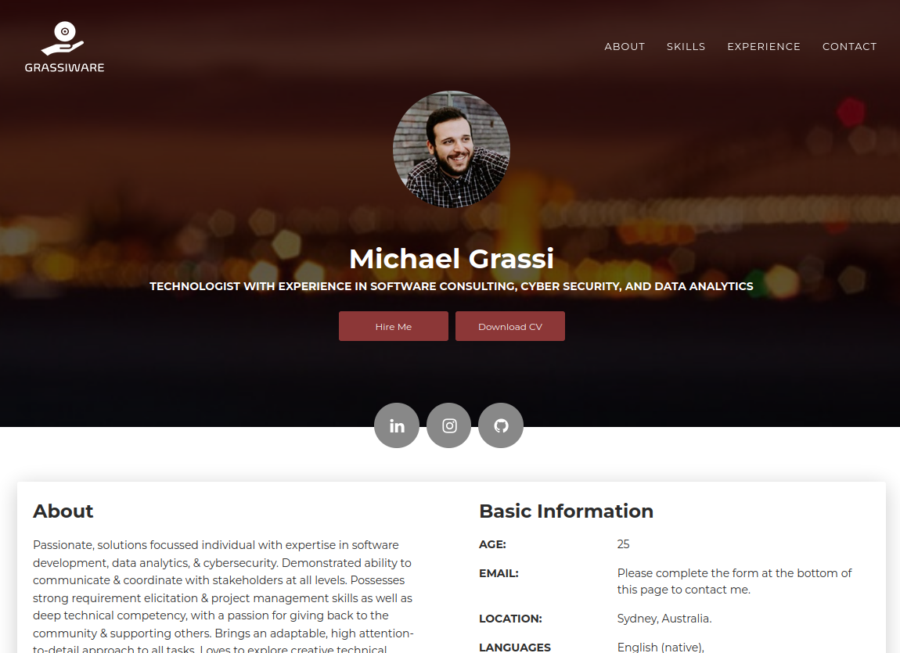
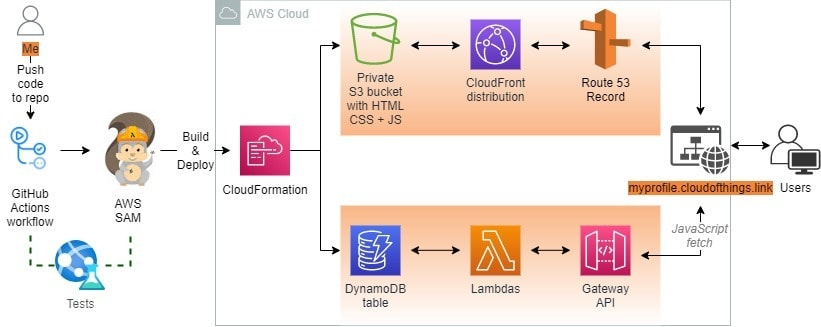

## Welcome
Hello! This repo is my attempt at the [cloud resume challenge](https://cloudresumechallenge.dev/). You can visit my website [here](https://iacresume.grassiware.app).

## Progress
Challenge tasks:
* ❌ 1. Certification
* ✅ 2. HTML
* ✅ 3. CSS
* ✅ 4. Static Website
* ✅ 5. HTTPS
* ✅ 6. DNS
* ✅ 7. Javascript
* ✅ 8. Database
* ✅ 9. API
* ✅ 10. Python
* ❌ 11. Tests
* ✅ 12. Infrastructure as Code
* ✅ 13. Source Control
* ✅ 14. CI/CD (Back-End)
* ✅ 15. CI/CD (Front-End)
* ❌ 16. Blog Post

Other to-do:
* Fix mobile view logo sizing. 
* Optimize properties defined in IAC to cost reduce in AWS.

## Architecture

Diagram above is from [Leszek Ucinski's blog](https://dev.to/cloudedthings/cloud-resume-challenge-aws-1mhh). 

## Thanks for visiting! :)
If you're thinking of having a go at this challenge, [Open Up The Cloud's video series](https://www.youtube.com/channel/UCAklaE5D59xWtip-3Jwa7xA) is an immensely useful resource. 

Also, I found [this](https://shishirkh.medium.com/guide-to-the-cloud-resume-challenge-part-1-s3-and-cloudfront-fce220cf8f0e) medium article useful for learning to navigate around the console.